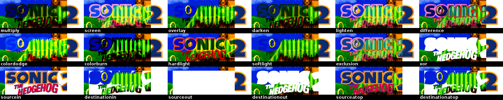
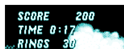
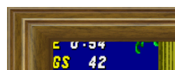
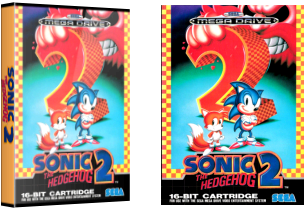
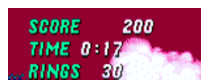
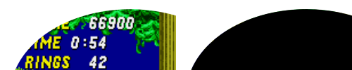
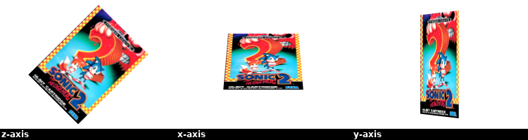
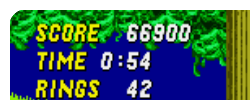
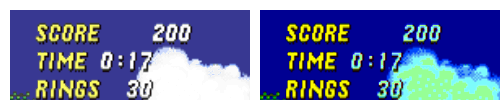
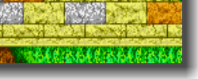

# Artwork look and effects
Skyscraper allows you to fully customize how you want the final frontend artwork to appear by editing the file `/home/USER/.skyscraper/artwork.xml`. Each piece of artwork can be composited from one or more of the other artwork resources and you can even apply several effects to them.

* Each `<output>` node exports a single piece of artwork.
* If no `<layer>` nodes are nested in an output node, it will simply export the defined type as raw unmanipulated artwork.
* All layer nodes and their nested effects are rendered / applied top-to-bottom.

Read on for an example `artwork.xml` and a more thorough description of the `<output>`, `<layer>` and the various available effect nodes.

NOTE 1!!! Some users seem to have a habbit of editing the `/home/USER/skysource/artwork.xml` file. THIS IS NOT THE CORRECT FILE! Please read the first paragraph. :)

NOTE 2! Every time you change the artwork configuration, remember to regenerate the game list. Your changes won't take effect until you do so. Read more about this [here](https://github.com/muldjord/skyscraper/blob/master/docs/USECASE.md#the-game-list-generation-phase).

Watch a video demonstrating the artwork compositing features [here](https://youtu.be/TIDD8EFSz50). Note that the video is quite old and only demonstrates a fraction of the possibilities you have with the Skyscraper compositor. It's all thoroughly documented below.

## Example artwork.xml
An example could look something like this:
```
<?xml version="1.0" encoding="UTF-8"?>
<artwork>
  <output type="screenshot" width="640" height="480">
    <layer resource="screenshot" x="20" width="520" height="390" align="center" valign="middle">
      <rounded radius="10"/>
      <stroke width="5"/>
    </layer>
    <layer resource="cover" height="250" x="0" y="-10" valign="bottom">
      <gamebox side="wheel" rotate="90"/>
      <shadow distance="5" softness="5" opacity="70"/>
    </layer>
    <layer resource="wheel" width="250" x="-10" align="right">
      <shadow distance="5" softness="5" opacity="70"/>
    </layer>
  </output>
</artwork>
```
Which results in a screenshot being exported to look like this:


## Xml definitions
Click the following links to quickly go to a desired section:

Nodes: [Xml node](#xml-node-not-optional), [Artwork node](#artwork-node-not-optional), [Output node](#output-nodes-optional), [Layer node](#layer-nodes-optional)

Effects: [Blur effect](#blur-effect-node-optional), [Brightness effect](#brightness-effect-node-optional), [Color balance effect](#balance-effect-node-optional), [Colorize effect](#colorize-effect-node-from-v233-optional), [Contrast effect](#contrast-effect-node-optional), [Frame effect](#frame-effect-node-optional), [Gamebox effect](#gamebox-effect-node-optional), [Hue effect](#hue-effect-node-from-v233-optional), [Mask effect](#mask-effect-node-optional), [Opacity effect](#opacity-effect-node-optional), [Rotate effect](#rotate-effect-node-from-v233-optional), [Rounded effect](#rounded-effect-node-optional), [Saturation effect](#saturation-effect-node-from-v233-optional), [Scanlines effect](#scanlines-effect-node-from-v290-optional), [Shadow effect](#shadow-effect-node-optional), [Stroke effect](#stroke-effect-node-optional).

Other: [Custom image resources](#custom-image-resources).

### xml node (Not optional)
```
<?xml version="1.0" encoding="UTF-8"?>
```
This is a special node used to describe the xml language used in the document. Don't change it.

### 'artwork' node (Not optional)
```
<artwork>
...
</artwork>
```
This node is the document base node. It contains all other nodes. Don't change or delete it.

### 'output' node(s) (Optional)
```
<output type="screenshot" resource="wheel" mpixels="0.1" width="640" height="400">
...
<output>
```
The output node describes a single piece of artwork to be exported when scraping. You can have as many (or few) output nodes as you like.

An output node with no nested 'layer' nodes will export the type with no compositing.

#### 'type' attribute (Not optional)
The type to be exported. Can be:
* screenshot
* cover
* wheel
* marquee

#### 'resource' attribute [from v2.7.6] (Optional)
The resource attribute can be set to one of the following:
* screenshot
* cover
* wheel
* marquee

For instance, if you wish to export a 'marquee' image but want it to make use of the 'wheel' resource instead, you can set ```<output type="marquee" resource="wheel"/>```. It will then export a 'marquee' but use the raw unmanipulated 'wheel' image when doing so. So if your frontend theme, such as some EmulationStation themes, makes use of the 'marquee' artwork, it will then be using the 'wheel' for it. If this attribute is left out, 'resource' will be set to the same as 'type'.

NOTE! The `screenshot`, `cover`, `wheel` and `marquee` types are hardcoded. It's not currently possible to create custom types.

#### 'mpixels' attribute [from v2.7.8] (Optional)
Set the desired area size for the image resource in mpixels (eg '0.1'). This can be used as an alternative to setting width or height and is useful in cases where images vary a lot in size. 'width' and 'height' attributes will be ignored if this is set.

#### 'width' and 'height' attributes (Optional)
Sets the width and height of the artwork export. If both are left out it will use the original size of the scraped artwork. If one is left out, it will keep the aspect ratio relative to that.

### 'layer' node(s) (Optional)
```
<layer resource="cover" mode="overlay" opacity="50" x="5" y="5" mpixels="0.1" width="10" height="10" align="center" valign="middle"/>
...
</layer>
```
Like layers in Gimp or almost any other respectable photo manipulation software, you can add as many of these nodes as you like. You can even nest them inside of each other, in which case the child layer will be anchored to the topleft corner of the parent layer, making it easier to align.

NOTE!!! Layer and effect nodes are rendered from top to bottom.

#### 'resource' attribute (Optional)
The artwork resource to be used by the layer. It can be:
* screenshot
* cover
* wheel
* marquee

If the resource attribute is left out the layer will simply be transparent. This is useful when aligning nested layers that differ in size across games.

#### 'mode' attribute [from v2.3.3] (Optional)
Sets the layer render mode. It can be:
* multiply
* screen
* overlay
* darken
* lighten
* colordodge
* colorburn
* hardlight
* softlight
* difference
* exclusion
* sourcein
* destinationin
* sourceout
* destinationout
* sourceatop
* destinationatop
* xor

If left out the layer is simply rendered as is on top of the parent layer.



#### 'opacity' attribute [from v2.3.3] (Optional)
Defines the opacity of the layer. 100 is completely visible. 0 is completely transparent.

#### 'x' and 'y' attributes (Optional)
X and Y coordinates for placement. Relative to 'align' and 'valign' and the parent layer. Either can be left out in which case it will be set to 0.

#### 'mpixels' attribute [from v2.7.8] (Optional)
Set the desired area size for the image resource in mpixels (eg '0.1'). This can be used as an alternative to setting width or height and is useful in cases where images vary a lot in size. 'width' and 'height' attributes will be ignored if this is set.

#### 'width' and 'height' attributes (Optional)
Sets the width and height of the layer. If either is left out it will keep the aspect ratio relative to the other. If both are left out it will use the original dimensions of the scraped resource.

#### 'align' attribute (Optional)
The horizontal alignment of the layer. It can be:
* left
* center
* right

The alignment is relative to the parent layer.

#### 'valign' attribute (Optional)
The vertical alignment of the layer. It can be:
* top
* middle
* bottom

The alignment is relative to the parent layer.

### 'balance' effect node (Optional)

```
<layer>
  <balance red="10" green="20" blue="30"/>
</layer>
```
Must be nested inside a layer node. Adjusts the color balance of the parent layer.

#### 'red' attribute (Optional)
The red color adjustment. Can be -255 to 255.
#### 'green' attribute (Optional)
The green color adjustment. Can be -255 to 255.
#### 'blue' attribute (Optional)
The blue color adjustment. Can be -255 to 255.

### 'blur' effect node (Optional)

```
<layer>
  <blur softness="5"/>
</layer>
```
Must be nested inside a layer node. Blurs the parent layer.

#### 'softness' attribute (Not optional)
Defines the radius of the blur. Higher means blurrier.

### 'brightness' effect node (Optional)

```
<layer>
  <brightness value="10"/>
</layer>
```
Must be nested inside a layer node. Adjusts the brightness of the parent layer.

#### 'value' attribute (Not optional)
The difference value for the adjustment. Can be -255 to 255.

### 'colorize' effect node [from v2.3.3] (Optional)

```
<layer>
  <colorize hue="180" saturation="-50"/>
</layer>
```
Must be nested inside a layer node. Colorizes the parent layer with a single hue.

#### 'hue' attribute (Not optional)
Sets the hue in degrees. Can be 0 to 360.

#### 'saturation' attribute (Optional)
Sets the saturation delta value of the colorize effect. Can be -127 to 127.

### 'contrast' effect node (Optional)

```
<layer>
  <contrast value="10"/>
</layer>
```
Must be nested inside a layer node. Adjusts the contrast of the parent layer.

#### 'value' attribute (Not optional)
The difference value for the adjustment. Can be -255 to 255.

### 'frame' effect node (Optional)

```
<layer>
  <frame file="[custom image resource]" x="0" y="0" width="100" height="100"/>
</layer>
```
Must be nested inside a layer node. This applies a frame to the parent layer.

NOTE: You can get some cool results by first applying a mask, then applying a frame. This is useful for frames that aren't square.

#### 'file' attribute (Not optional)
The filename of the [custom image resource](#custom-image-resources) to be used as frame.
#### 'width' attribute (Optional)
Sets the width of the frame in pixels. If left out it will be set to the width of the parent layer.
#### 'height' attribute (Optional)
Sets the height of the frame in pixels. If left out it will be set to the height of the parent layer.
#### 'x' attribute (Optional)
Sets the x coordinate of the frame relative to the parent layer. If left out it will be set to 0.
#### 'y' attribute (Optional)
Sets the y coordinate of the frame relative to the parent layer. If left out it will be set to 0.

### 'gamebox' effect node (Optional)
Left image shows the result with the wheel artwork applied to the side. Right image shows the original cover layer.

```
<layer resource="cover" height="200">
  <gamebox side="[custom image resource]" rotate="90" sidescaling="both"/>
</layer>
```
Must be nested inside a layer node. Renders a nifty looking 3D game box. It uses the parent layer image on the front of the box.

#### 'side' attribute (Optional)
The filename of the [custom image resource](#custom-image-resources) to be used on the side of the box.
#### 'rotate' attribute (Optional)
Defines the rotation of the side image in degrees.

#### 'sidescaling' attribute [from v2.7.1] (Optional)
Defines how to scale the side / spine image. If left out, it will autoscale depending on the size of the artwork resource. Can be 'width', 'height' or 'both'.

### 'hue' effect node [from v2.3.3] (Optional)

```
<layer>
  <hue value="100"/>
</layer>
```
Must be nested inside a layer node. Rotates the hue of the parent layer.

#### 'value' attribute (Not optional)
The difference value for the adjustment. Can be 0 to 359.

### 'mask' effect node (Optional)
Left image shows the result. Right image shows the mask used. The white part of the mask is transparent.

```
<layer>
  <mask file="[custom image resource]" x="0" y="0" width="100" height="100"/>
</layer>
```
Must be nested inside a layer node. This applies a mask to the parent layer.

#### 'file' attribute (Not optional)
The filename of the [custom image resource](#custom-image-resources) to be used as mask. The alpha channel of the mask will blind out the underlying parts of the parent layer.
#### 'width' attribute (Optional)
Sets the width of the mask in pixels. If left out it will be set to the width of the parent layer.
#### 'height' attribute (Optional)
Sets the height of the mask in pixels. If left out it will be set to the height of the parent layer.
#### 'x' attribute (Optional)
Sets the x coordinate of the mask relative to the parent layer. If left out it will be set to 0.
#### 'y' attribute (Optional)
Sets the y coordinate of the mask relative to the parent layer. If left out it will be set to 0.

### 'opacity' effect node (Optional)

```
<layer>
  <opacity value="50"/>
</layer>
```
Must be nested inside a layer node. Adjusts the opacity of the parent layer.

#### 'value' attribute (Not optional)
The opacity of the layer. Can be 0-100 where 0 is completely transparent and 100 is opaque.

### 'rotate' effect node [from v2.3.3] (Optional)

```
<layer>
  <rotate degrees="45" axis="y"/>
</layer>
```
Must be nested inside a layer node. Rotates the parent layer around the x, y or z axis.

#### 'degrees' attribute (Not optional)
Sets how many degrees the parent layer will be rotated. Can be -360 to 360.

#### 'axis' attribute (Optional)
Sets which axis the parent layer should be rotated around. Can be 'x', 'y' or 'z'. If left out it will be set to 'z'.

### 'rounded' effect node (Optional)

```
<layer>
  <rounded radius="10"/>
</layer>
```
Must be nested inside a layer node. Rounds the corners of the parent layer.

#### 'radius' attribute (Not optional)
Defines the radius of the corners in pixels.

### 'saturation' effect node [from v2.3.3] (Optional)

```
<layer>
  <saturation value="-100"/>
</layer>
```
Must be nested inside a layer node. Adjusts the color saturation of the parent layer.

NOTE! If you want to completely greyscale your layer I highly recommend using the 'saturation' attribute of the 'colorize' effect instead. It uses a better estimation of percieved luminance.

#### 'value' attribute (Not optional)
The difference value for the adjustment. Can be -255 to 255.

### 'scanlines' effect node [from v2.9.0] (Optional)

```
<layer>
  <scanlines file="scanlines1.png" scale="1.0" opacity="100" mode="overlay"/>
</layer>
```
Must be nested inside a layer node. Adds a CRT monitor scanline effect to the parent layer.

#### 'file' attribute (Optional)
The filename of the [custom image resource](#custom-image-resources) to be used as the scanline overlay. If left out it defaults to `scanlines1.png`.

#### 'scale' attribute (Optional)
Sets the scale factor of the overlay. Can be 0.1 to 2.0. If left out it defaults to 1.0.

#### 'opacity' attribute (Optional)
Sets the opacity of the overlay. Can be 0 to 100. If left out it defaults to 100.

#### 'mode' attribute (Optional)
Sets the overlay compositing mode. It can be:
* multiply
* screen
* overlay
* darken
* lighten
* colordodge
* colorburn
* hardlight
* softlight
* difference
* exclusion
* sourcein
* destinationin
* sourceout
* destinationout
* sourceatop
* destinationatop
* xor

If left out the overlay is rendered using the `overlay` method.


### 'shadow' effect node (Optional)

```
<layer>
  <shadow distance="10" softness="5" opacity="50"/>
</layer>
```
Must be nested inside a layer node. Renders a dropshadow on the parent layer using the attributes provided. If either of the attributes are left out, the shadow won't be drawn.

#### 'distance' attribute (Not optional)
Distance in pixels from the layer. The distance is always down to the right.

#### 'softness' attribute (Not optional)
Defines how soft (radius) the shadow will appear. A value of 0 is sharpest.

#### 'opacity' attribute (Not optional)
Defines the opacity of the shadow. 100 is completely visible. 0 is completely transparent.

### 'stroke' effect node (Optional)

```
<layer>
  <stroke width="5" red="10" green="20" blue="30"/>
</layer>
```
Must be nested inside a layer node. Renders a colored outline on the parent layer. If all color attributes are left out, it averages a suitable color from the parent layer.

#### 'width' attribute (Not optional)
The width of the outline in pixels.
#### 'red' attribute (Optional)
The red color value for the outline. Can be 0-255. If left out it is set to 0.
#### 'green' attribute (Optional)
The green color value for the outline. Can be 0-255. If left out it is set to 0.
#### 'blue' attribute (Optional)
The blue color value for the outline. Can be 0-255. If left out it is set to 0.
#### 'color' attribute [from v2.3.1] (Optional)
Provides the color to use hex-style. This can be used instead of the 'red', 'green' and 'blue' attributes described above. An example could be 'color="#ff0099"'.

## Custom image resources
From Skyscraper version 2.3.0 you can use custom image resources wherever the documentation says so. Place your custom resources in the '`/home/USER/.skyscraper/resources`' folder and use it by adding the filename to the attribute.

Example:
```
<gamebox side="megadrive_logo.png" rotate="90"/>
```
The file megadrive_logo.png will then be loaded from the '`/home/USER/.skyscraper/resources/megadrive_logo.png`' file. Feel free to create subfolders inside the resources folder. If you do, remember to add the partial path to the filename like so:
```
<gamebox side="platform_logos/megadrive_logo.png" rotate="90"/>
```
This will look for the file at '`/home/USER/.skyscraper/resources/platform_logos/megadrive_logo.png`'.

Word of warning: All custom image resources are loaded into memory when Skyscraper starts to avoid repeatedly reading them from disc / SD card. So please keep your resources to a minimum - otherwise it might exceed the total memory on the Pi which will cause Skyscraper to get killed by the kernel.
